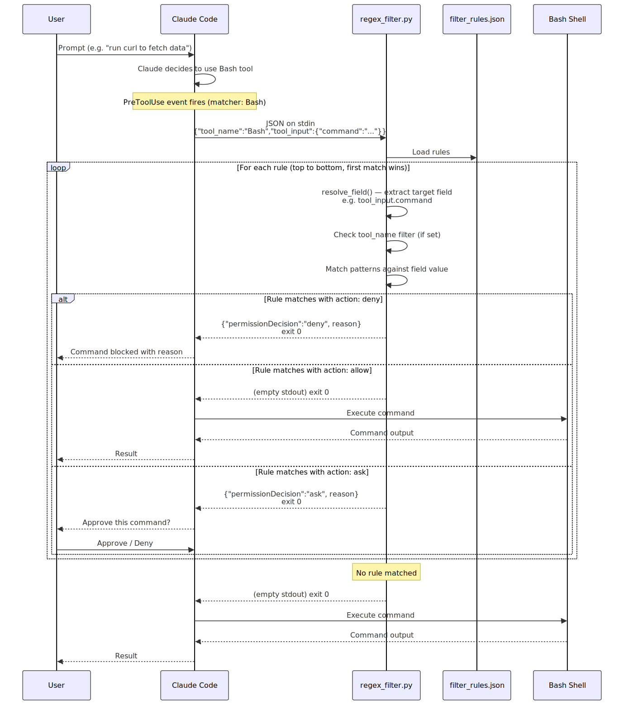

# hook-hole

Security hooks for [Claude Code](https://docs.anthropic.com/en/docs/claude-code) that intercept Bash commands before execution and block credential leaks, untrusted network calls, and PII exposure.

Two complementary layers:

| Hook | What it catches | Latency | Dependencies |
|------|----------------|---------|--------------|
| **regex_filter** | API keys, tokens, untrusted endpoints | <1ms | None |
| **llm_filter** | PII (names, emails, SSNs, credit cards) | 3-25ms | One NLP plugin |

## Installation

### Prerequisites

- [Claude Code](https://docs.anthropic.com/en/docs/claude-code) CLI installed
- Python 3.10+

### 1. Clone the repository

```bash
git clone https://github.com/YOUR_USER/hook-hole.git
cd hook-hole
```

### 2. Copy hooks into your project

Copy the `.claude/` directory into any project where you want the hooks active:

```bash
cp -r .claude /path/to/your/project/
```

Or use this repo directly as your project.

### 3. Install an NLP plugin (optional, for PII detection)

The regex filter works with zero dependencies. For NLP-based PII detection, install one backend:

```bash
# spaCy — recommended, lightweight, ~3ms
pip install spacy
python -m spacy download en_core_web_sm

# Microsoft Presidio — fastest, ~0.4ms, known PII types
pip install presidio-analyzer

# DistilBERT — best accuracy, ~25ms
pip install transformers torch
```

Or install from the requirements file (spaCy by default):

```bash
pip install -r requirements.txt
python -m spacy download en_core_web_sm
```

### 4. Verify installation

```bash
python3 test_hook.py        # Regex filter tests (always works)
python3 test_llm_hook.py    # NLP filter tests (needs a plugin installed)
```

### 5. Restart Claude Code

Hooks are loaded at session startup. Restart Claude Code or run `/hooks` to review the active hooks.

## How It Works

When Claude Code is about to run a Bash command, two hooks fire in sequence:

```
Bash command → regex_filter.py → llm_filter.py → execute or block
```

### Regex filter (layer 1)

Evaluates rules from `.claude/hooks/filter_rules.json` top-to-bottom. First match wins.

| Rule | Action | What it catches |
|------|--------|----------------|
| `block_sensitive_data` | DENY | API keys (`sk-ant-*`, `sk-*`), AWS creds, GitHub tokens, private keys, hardcoded passwords |
| `allow_trusted_endpoints` | ALLOW | localhost, package registries (PyPI, npm, crates.io), VCS hosts (GitHub, GitLab, Bitbucket) |
| `block_untrusted_network` | DENY | curl, wget, ssh, Python requests/httpx, JS fetch/axios, Anthropic/OpenAI SDK calls, netcat, etc. |

### NLP filter (layer 2)

Detects PII that regex can't catch — real names, email addresses, phone numbers, SSNs, credit card numbers embedded in commands.

Tries plugins in priority order from `.claude/hooks/llm_filter_config.json`, uses the first available:

| Plugin | Tier | Latency | Best for |
|--------|------|---------|----------|
| presidio | SubMillisecond | ~0.4ms | Production, known PII types |
| spacy | EdgeDevice | ~3ms | Low resource, good default |
| distilbert | HighAccuracy | ~25ms | Maximum detection accuracy |

## Configuration

### Allow a trusted endpoint

Add a pattern to the `allow_trusted_endpoints` rule in `.claude/hooks/filter_rules.json`:

```json
{"pattern": "https?://api\\.your-company\\.com", "label": "Your API"}
```

### Adjust NLP sensitivity

Edit `.claude/hooks/llm_filter_config.json`:

```json
{
  "min_confidence": 0.7,
  "action": "deny",
  "entity_types": ["PERSON", "EMAIL_ADDRESS", "PHONE_NUMBER", "US_SSN", "CREDIT_CARD"]
}
```

- `min_confidence` — lower catches more, higher reduces false positives (default: 0.7)
- `action` — `"deny"` blocks, `"ask"` prompts user for approval
- `entity_types` — which PII types to detect

### Disable a hook

Set `"enabled": false` in `llm_filter_config.json` to disable the NLP hook, or remove its entry from `.claude/settings.json`.

### Add a custom NLP plugin

1. Create `.claude/hooks/plugins/my_plugin.py`:

```python
from .base import DetectionResult, SensitiveContentPlugin

class MyPlugin(SensitiveContentPlugin):
    name = "my_plugin"
    tier = "Custom"

    def is_available(self) -> bool:
        try:
            import my_library
            return True
        except ImportError:
            return False

    def detect(self, text, entity_types=None):
        # Return list of DetectionResult
        return []
```

2. Register in `.claude/hooks/plugins/plugins.json`:

```json
{
  "my_plugin": {
    "module": "plugins.my_plugin",
    "class": "MyPlugin",
    "tier": "Custom",
    "latency": "~5ms",
    "description": "My custom detector",
    "install": "pip install my-library"
  }
}
```

3. Add to `llm_filter_config.json`:

```json
{
  "plugin_priority": ["my_plugin", "presidio", "spacy"],
  "plugins": {
    "my_plugin": {
      "enabled": true
    }
  }
}
```

## Project Structure

```
.claude/
  settings.json                  # Hook registration (PreToolUse, matcher: Bash)
  hooks/
    regex_filter.py              # Layer 1: regex rule engine
    filter_rules.json            # Regex rules (endpoints, credentials, network)
    llm_filter.py                # Layer 2: NLP plugin dispatcher
    llm_filter_config.json       # NLP plugin config (priority, thresholds)
    plugins/
      plugins.json               # Plugin registry (add custom plugins here)
      base.py                    # SensitiveContentPlugin ABC + DetectionResult
      presidio_plugin.py         # Microsoft Presidio backend
      spacy_plugin.py            # spaCy + regex backend
      distilbert_plugin.py       # DistilBERT NER backend
docs/
  sequence-diagram.svg           # Full pipeline sequence diagram
  decision-flow.svg              # Decision flowchart
test_hook.py                     # Regex filter tests (23 cases)
test_llm_hook.py                 # NLP filter tests (9 cases)
```

## Diagrams

### Decision Flow



### Sequence Diagram



## License

[Business Source License 1.1](LICENSE)

Free for non-production use (evaluation, testing, development, personal projects, academic research). Production use requires a commercial license — contact the Licensor.

On the Change Date (4 years after each version's release), that version converts to [Apache License 2.0](https://www.apache.org/licenses/LICENSE-2.0).

NLP plugin dependencies (spaCy, Presidio, transformers, PyTorch) use permissive licenses (MIT/Apache 2.0/BSD).
