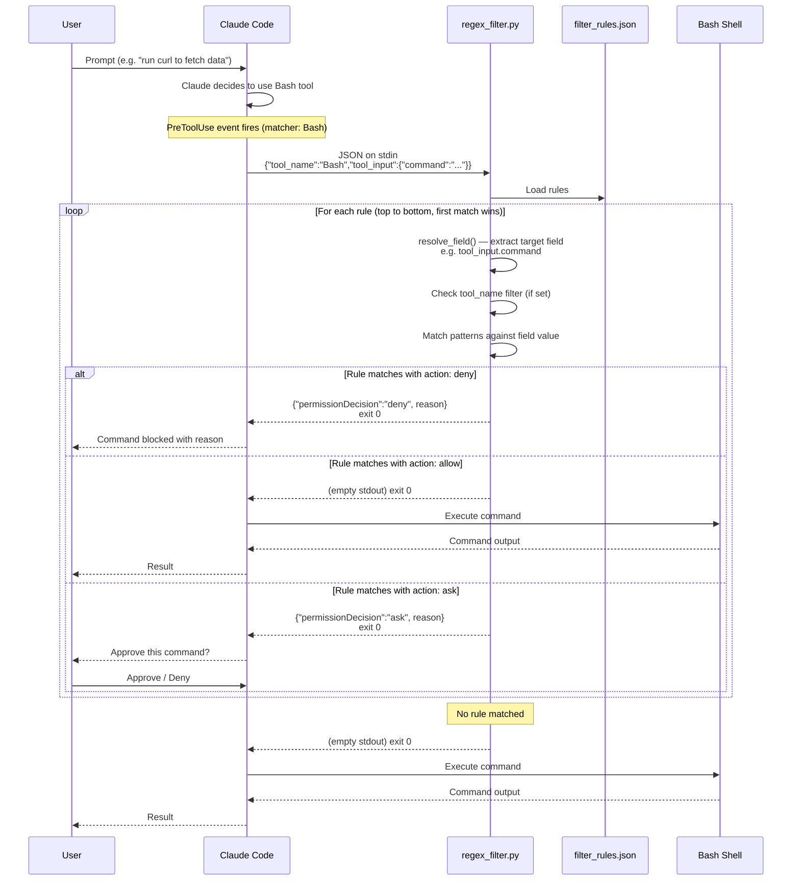
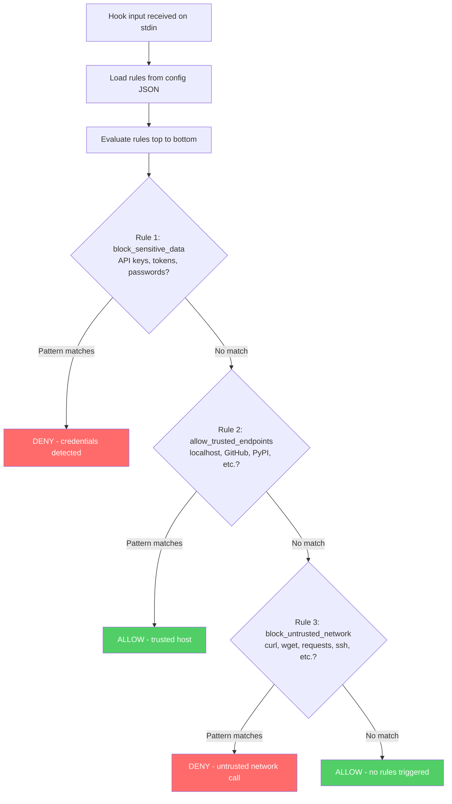

# Regex Filter Hook — Diagrams

## Sequence Diagram

```mermaid
sequenceDiagram
    participant User
    participant ClaudeCode as Claude Code
    participant Filter as regex_filter.py
    participant Config as filter_rules.json
    participant Shell as Bash Shell

    User->>ClaudeCode: Prompt (e.g. "run curl to fetch data")
    ClaudeCode->>ClaudeCode: Claude decides to use Bash tool

    Note over ClaudeCode: PreToolUse event fires (matcher: Bash)

    ClaudeCode->>Filter: JSON on stdin<br/>{"tool_name":"Bash","tool_input":{"command":"..."}}
    Filter->>Config: Load rules

    loop For each rule (top to bottom, first match wins)
        Filter->>Filter: resolve_field() — extract target field<br/>e.g. tool_input.command
        Filter->>Filter: Check tool_name filter (if set)
        Filter->>Filter: Match patterns against field value

        alt Rule matches with action: deny
            Filter-->>ClaudeCode: {"permissionDecision":"deny", reason}<br/>exit 0
            ClaudeCode-->>User: Command blocked with reason
        else Rule matches with action: allow
            Filter-->>ClaudeCode: (empty stdout) exit 0
            ClaudeCode->>Shell: Execute command
            Shell-->>ClaudeCode: Command output
            ClaudeCode-->>User: Result
        else Rule matches with action: ask
            Filter-->>ClaudeCode: {"permissionDecision":"ask", reason}<br/>exit 0
            ClaudeCode-->>User: Approve this command?
            User->>ClaudeCode: Approve / Deny
        end
    end

    Note over Filter: No rule matched
    Filter-->>ClaudeCode: (empty stdout) exit 0
    ClaudeCode->>Shell: Execute command
    Shell-->>ClaudeCode: Command output
    ClaudeCode-->>User: Result
```

## Decision Flow (with shipped rules)

```mermaid
flowchart TD
    A[Hook input received on stdin] --> B[Load rules from config JSON]
    B --> C[Evaluate rules top to bottom]

    C --> D{Rule 1: block_sensitive_data<br/>API keys, tokens, passwords?}
    D -->|Pattern matches| E[DENY - credentials detected]
    D -->|No match| F{Rule 2: allow_trusted_endpoints<br/>localhost, GitHub, PyPI, etc.?}
    F -->|Pattern matches| G[ALLOW - trusted host]
    F -->|No match| H{Rule 3: block_untrusted_network<br/>curl, wget, requests, ssh, etc.?}
    H -->|Pattern matches| I[DENY - untrusted network call]
    H -->|No match| J[ALLOW - no rules triggered]

    style E fill:#ff6b6b,color:#fff
    style I fill:#ff6b6b,color:#fff
    style G fill:#51cf66,color:#fff
    style J fill:#51cf66,color:#fff
```
