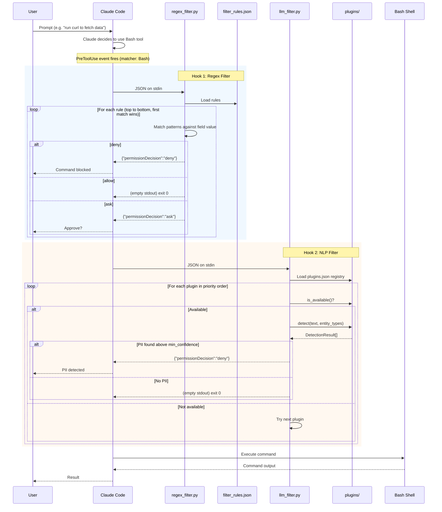
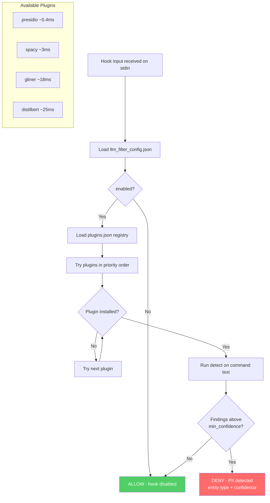

# Hook System — Diagrams

## Full Pipeline Sequence

```mermaid
sequenceDiagram
    participant User
    participant ClaudeCode as Claude Code
    participant Regex as regex_filter.py
    participant Rules as filter_rules.json
    participant NLP as llm_filter.py
    participant Plugins as plugins/
    participant Shell as Bash Shell

    User->>ClaudeCode: Prompt (e.g. "run curl to fetch data")
    ClaudeCode->>ClaudeCode: Claude decides to use Bash tool

    Note over ClaudeCode: PreToolUse event fires (matcher: Bash)

    rect rgb(240, 248, 255)
        Note over Regex,Rules: Hook 1: Regex Filter
        ClaudeCode->>Regex: JSON on stdin
        Regex->>Rules: Load rules

        loop For each rule (top to bottom, first match wins)
            Regex->>Regex: Match patterns against field value
            alt deny
                Regex-->>ClaudeCode: {"permissionDecision":"deny"}
                ClaudeCode-->>User: Command blocked
            else allow
                Regex-->>ClaudeCode: (empty stdout) exit 0
            else ask
                Regex-->>ClaudeCode: {"permissionDecision":"ask"}
                ClaudeCode-->>User: Approve?
            end
        end
    end

    rect rgb(255, 248, 240)
        Note over NLP,Plugins: Hook 2: NLP Filter
        ClaudeCode->>NLP: JSON on stdin
        NLP->>Plugins: Load plugins.json registry

        loop For each plugin in priority order
            NLP->>Plugins: is_available()?
            alt Available
                NLP->>Plugins: detect(text, entity_types)
                Plugins-->>NLP: DetectionResult[]
                alt PII found above min_confidence
                    NLP-->>ClaudeCode: {"permissionDecision":"deny"}
                    ClaudeCode-->>User: PII detected
                else No PII
                    NLP-->>ClaudeCode: (empty stdout) exit 0
                end
            else Not available
                NLP->>NLP: Try next plugin
            end
        end
    end

    ClaudeCode->>Shell: Execute command
    Shell-->>ClaudeCode: Command output
    ClaudeCode-->>User: Result
```

## Regex Filter Decision Flow

```mermaid
flowchart TD
    A[Hook input received on stdin] --> B[Load rules from filter_rules.json]
    B --> C[Evaluate rules top to bottom]

    C --> D{Rule 1: block_sensitive_data<br/>API keys, tokens, passwords?}
    D -->|Pattern matches| E[DENY - credentials detected]
    D -->|No match| F{Rule 2: allow_trusted_endpoints<br/>localhost, GitHub, PyPI, etc.?}
    F -->|Pattern matches| G[ALLOW - trusted host]
    F -->|No match| H{Rule 3: block_untrusted_network<br/>curl, wget, requests, ssh, etc.?}
    H -->|Pattern matches| I[DENY - untrusted network call]
    H -->|No match| J[ALLOW - no rules triggered]

    style E fill:#ff6b6b,color:#fff
    style I fill:#ff6b6b,color:#fff
    style G fill:#51cf66,color:#fff
    style J fill:#51cf66,color:#fff
```

## NLP Filter Plugin Flow

```mermaid
flowchart TD
    A[Hook input received on stdin] --> B[Load llm_filter_config.json]
    B --> C{enabled?}
    C -->|No| D[ALLOW - hook disabled]
    C -->|Yes| E[Load plugins.json registry]
    E --> F[Try plugins in priority order]

    F --> G{Plugin installed?}
    G -->|No| H[Try next plugin]
    H --> G
    G -->|Yes| I[Run detect on command text]
    I --> K{Findings above<br/>min_confidence?}
    K -->|No| D
    K -->|Yes| L[DENY - PII detected<br/>entity type + confidence]

    style D fill:#51cf66,color:#fff
    style L fill:#ff6b6b,color:#fff

    subgraph Available Plugins
        P1[presidio ~0.4ms]
        P2[spacy ~3ms]
        P3[gliner ~18ms]
        P4[distilbert ~25ms]
    end
```
